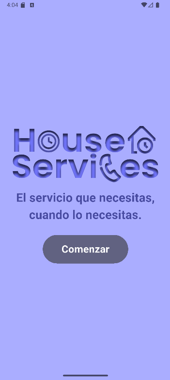
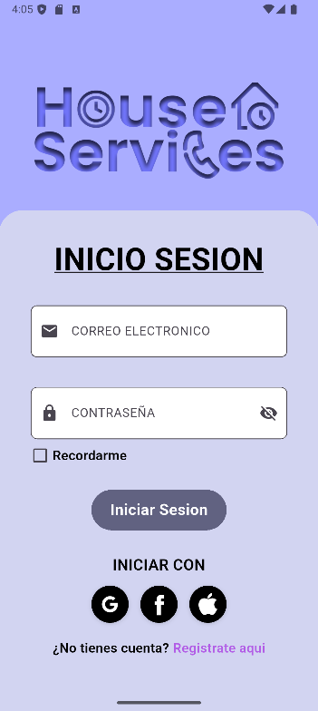
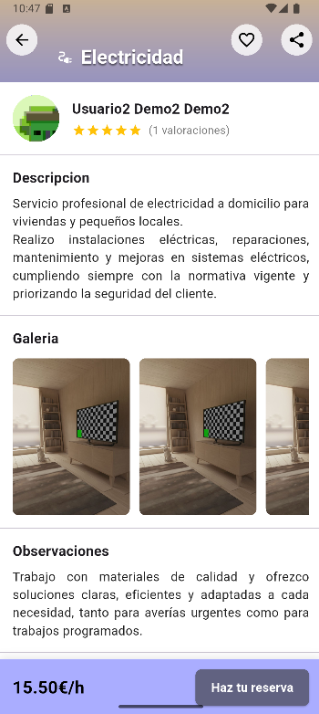
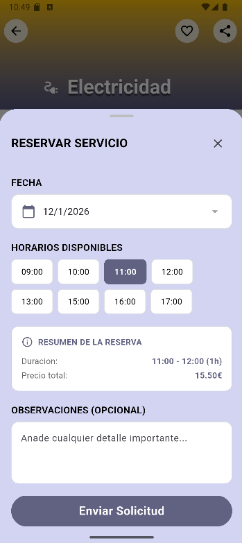
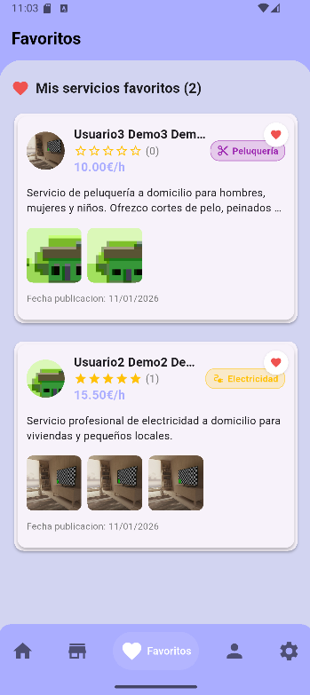
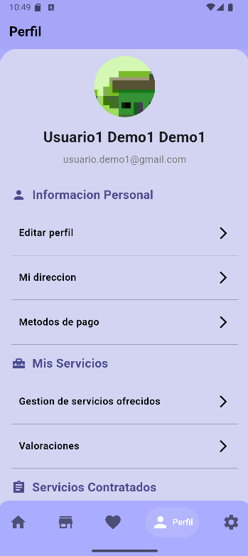
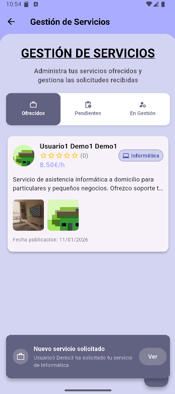
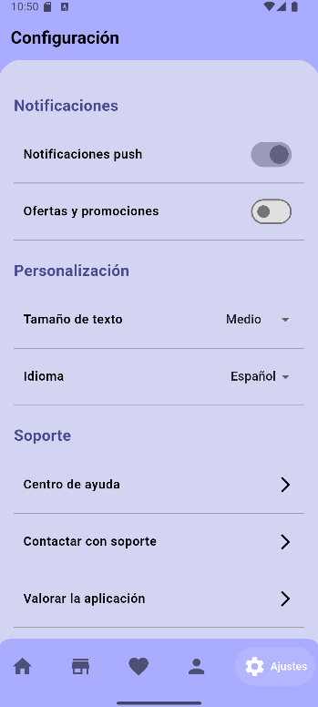

# HouseServices

Aplicación móvil para **contratar y ofrecer servicios a domicilio**, con un backend que implementa una **API REST propia** y un despliegue sencillo para levantar la infraestructura local con **Docker**.

## Tecnologías utilizadas

- **App (Frontend):** Flutter (Dart)
- **API (Backend):** Kotlin + Spring Boot
- **Base de datos:** MySQL
- **Infraestructura local:** Docker + Docker Compose (levanta MySQL + backend)
- **Firebase Auth:** registro e inicio de sesión
- **Firebase Storage:** subida y gestión de imágenes
- **Firebase Cloud Messaging (FCM):** notificaciones push
- **Cloud Firestore:** favoritos (servicios marcados por el usuario)
- **Google Maps API:** mapa y selección/visualización de ubicación
- **Control de versiones:** Git + GitHub
- **Prototipado UI/UX:** Figma

## Prototipo (Figma)

Prototipo navegable: 
https://www.figma.com/proto/B4juOMcrYVCbK1gicMqVDt/HouseService?node-id=0-1&t=xdG3FS1GkZtTF3uk-1

## Funcionalidades

### Para clientes

- Registro e inicio de sesión con perfil completo (datos personales, ubicacion y foto opcional).
- Listado de servicios por categoría, busqueda por nombre/descripcion y seccion de destacados.
- Visualización de los detalles del servicio mostrando imágenes, precio por hora, descripción, observaciones y valoración media del trabajador.
- Reserva de servicios seleccionando dia y hora disponible y anadiendo observaciones.
- Cancelacion de solicitudes segun las reglas definidas en el flujo de reserva.
- Gestion de favoritos para guardar o quitar servicios y acceder a ellos rapidamente.
- Historial de servicios y valoraciones con puntuacion por estrellas y comentario tras finalizar el servicio.

### Para trabajadores

- Publicacion de servicios con categoria, precio, descripcion, imagenes y observaciones.
- Gestion de la disponibilidad mediante horarios por dia y excepciones (dias no disponibles o franjas especiales).
- Gestion de solicitudes recibidas con opcion de aceptar o denegar y notificacion al cliente.
- Gestion del servicio confirmado permitiendo marcar inicio y finalizacion y realizar seguimiento por estados.

### Notificaciones

- Notificaciones push (FCM) para eventos relevantes (nueva solicitud, aceptacion/denegacion, cambios de estado), ademas de avisos dentro de la app con notificaciones personalizadas. 

## Roles (cliente y trabajador)

- Un mismo usuario puede actuar como **cliente** o como **trabajador**.
- Desde la sección de **servicios ofrecidos**, la app muestra un diálogo para **activar el rol de trabajador** (pensado como base para una futura verificación real en un entorno de producción antes de permitir publicar servicios).

## Instalación y arranque

La guía completa está en `docs/SETUP.md` e incluye:
- Arranque de **MySQL + backend** con Docker Compose.
- Archivos necesarios para Firebase (cliente y Admin SDK) y Google Maps.
- Ejecución de la app indicando la URL del backend mediante `--dart-define`.

## Credenciales y configuración (no incluidas en el repo)

Por seguridad, este repositorio **NO incluye credenciales reales** (Firebase Admin SDK, `application.properties`, claves de Google Maps, etc.).
Para saber que ficheros o claves se necesitan para que todo funcione correcto, consultar `docs/SETUP.md`.

## Estructura del repositorio
- `frontend/` -> app Flutter (Dart)
  - `lib/` -> UI, controllers, models, services, utils
  - `android/`, `ios/`, `web/` -> plataformas
- `backend/` -> API REST Kotlin/Spring Boot
  - `controllers/` -> endpoints HTTP
  - `services/` -> lógica de negocio
  - `repositories/` -> acceso a datos (MySQL)
  - `models/` + `dto/` -> entidades y objetos de intercambio
- `infra/` -> Docker Compose + scripts de inicialización MySQL
  - `db/init/` -> SQL de arranque
- `docs/` -> documentación (SETUP, etc.)
- `resources/` -> recursos para documentación/README (logos e imágenes)

## Autoría y recursos
- El **diseño**, el **logo** y los recursos gráficos principales del proyecto han sido creados por **Rafael Antonio Muñoz Fernandez**.
- Nota: algunos iconos/logos/imágenes de terceros (p. ej. marcas de Google/Apple/Facebook) pertenecen a sus respectivos propietarios.

## Seguridad
Si detectas algún problema de seguridad, revisa `SECURITY.md`.

## Licencia
MIT — ver fichero `LICENSE`.

## Capturas de la APP 

  
  
  

  
  
  

  
  
  

